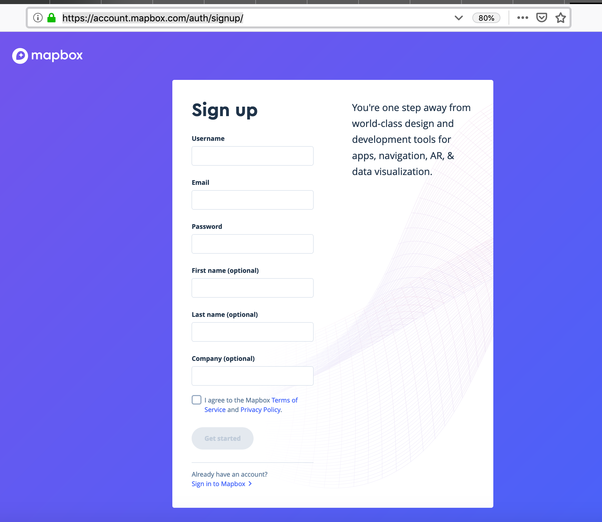
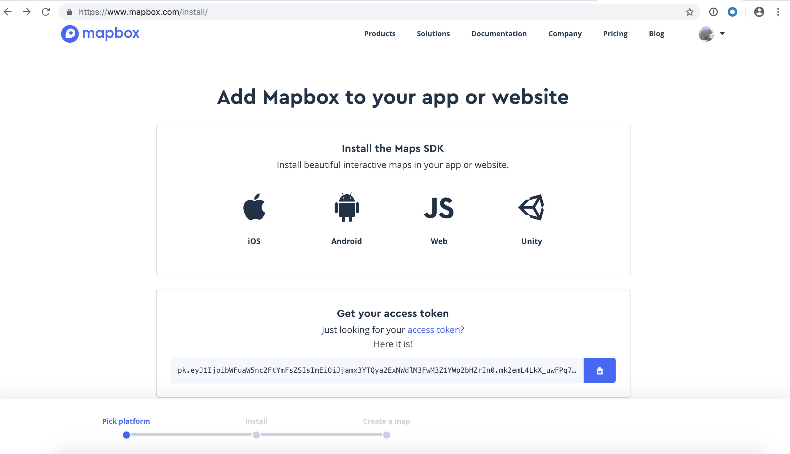
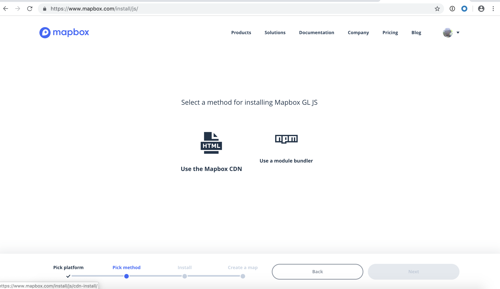
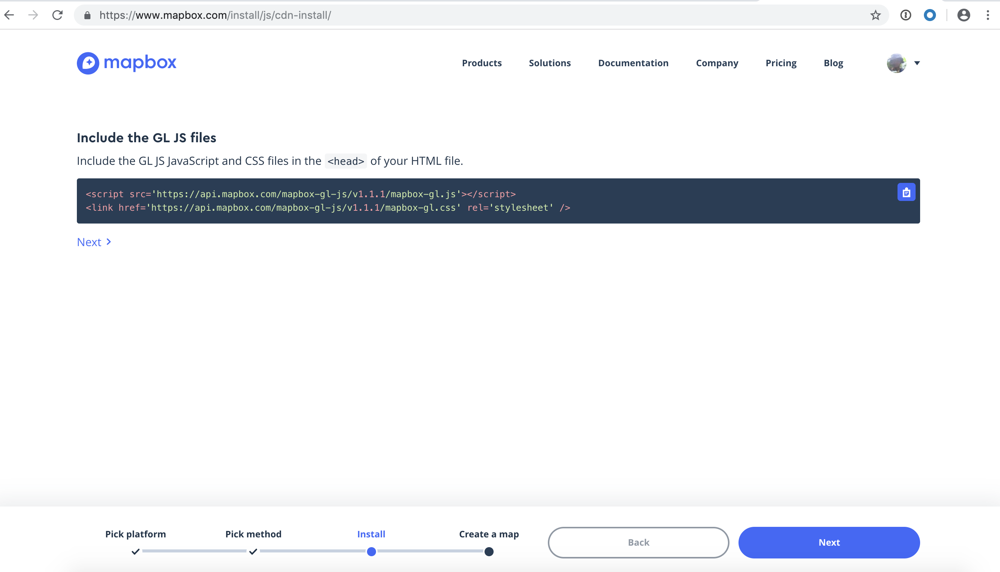
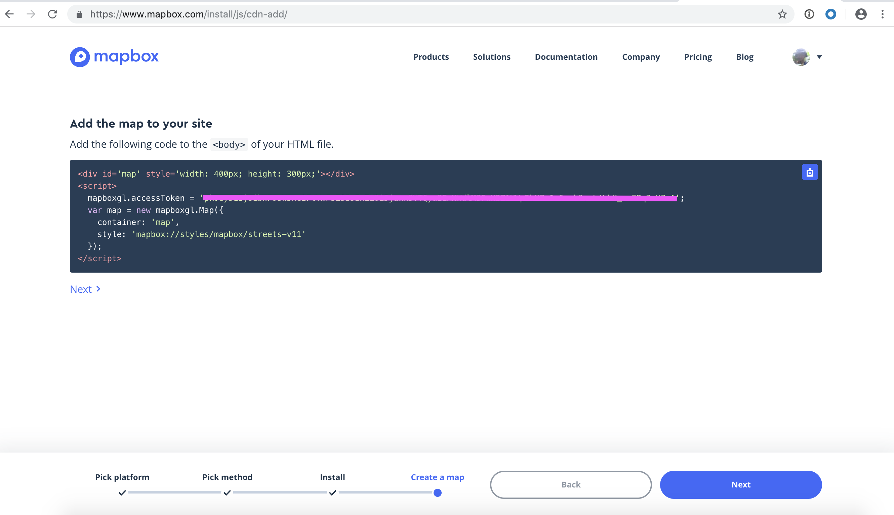
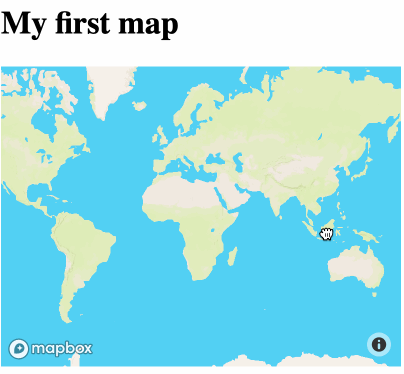

# Creating your first Mapbox map

This tutorial will guide you to creating your first map powered by Mapbox GL JS using 
the Mapbox interactive tutorial.

## Creating a mapbox account
* Sign-up for a mapbox account at: https://account.mapbox.com/auth/signup/



* If you have an existing Mapbox account, go to https://account.mapbox.com/

## Creating a blank html page 

* Open a text editor and copy the code below to create a blank html page.

```html
<!DOCTYPE html>
<html>
  <head>
    <meta charset="utf-8">
    <title>My test page</title>
  </head>
  <body>
    <h1>test</h1>
  </body>
</html>
```

* Save the file as `index.html`.
* Open the file in your browser.

## Creating your first Mapbox map

* To start creating your first map, go to: https://www.mapbox.com/install/



* In the **Pick platform** step, select **JS**.

* In the **Pick method** step, choose the **Use the Mapbox CDN**.



* Copy the GL JS JavaScript and CSS files shown in the **Install** in the <head> of your HTML file 
similar to the code below then click **Next**.

```html
<script src='https://api.mapbox.com/mapbox-gl-js/v1.1.1/mapbox-gl.js'></script>
<link href='https://api.mapbox.com/mapbox-gl-js/v1.1.1/mapbox-gl.css' rel='stylesheet' />
```




* Add the code shown in the **Create a map** to the <body> of your HTML file similar to the code below.

```javascript
<div id='map' style='width: 400px; height: 300px;'></div>
<script>
  mapboxgl.accessToken = <your_access_token>;
  var map = new mapboxgl.Map({
    container: 'map',
    style: 'mapbox://styles/mapbox/streets-v11'
  });
</script>
```



* Open your `index.html` in your browser.



**Congratulations you have just made you first Mapbox map!**

* Before we move to the next section, inspect your code and add the following:
  * Make the map occupy the full width of your browser.
  * Make the initial map view to focus to the Philippines.
  * Display the navigation controls to the map such as zoom and rotation buttons.
  * Hints are [available in this example](https://docs.mapbox.com/mapbox-gl-js/example/navigation/).
