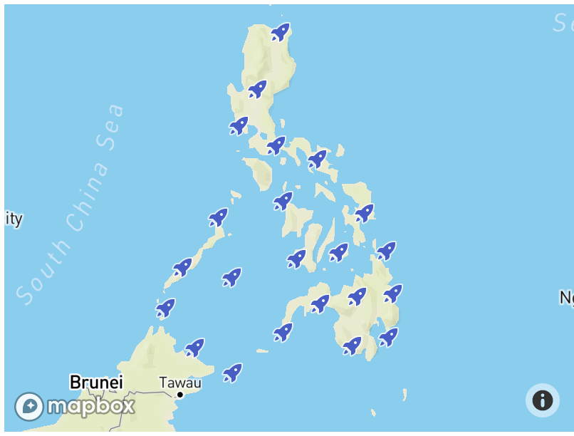
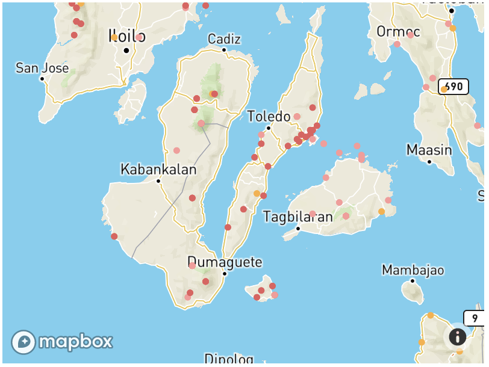

# Overview
This tutorial will guide you to adding custom data into your Mapbox map.
We will add a point layer of threatened birds in the Philippines from 
an external GeoJSON and customize the symbols of each point based on their IUCN status.

## About the data

The [birds data is available in this repo](data/birds.geojson) is IUCN's List of Threatened Birds 
in the Philippines from [Birdlife's Red Data Book](https://web.archive.org/web/20060202013628/http://www.rdb.or.id/) (2005).
The original list was converted to [GeoJSON](https://geojson.org/).  Each point has the following properties:

* `species` - scientific name of the species
* `en_name` - common name in English
* `status` - IUCN status as of 2005
* `location` - longitude and latitude of documented sightings

An example of the GeoJSON is below:

```
{
      "type": "Feature",
      "properties": {
        "species": "Spizaetus philippensis",
        "en_name": "Philippine Hawk-eagle",
        "status": "VUL"
      },
      "geometry": {
        "type": "Point",
        "coordinates": [
          121.15,
          14.8833
        ]
      }
}

```

##  Adding a GeoJSON to your map

* To add an external GeoJSON into your map, we will use the [`map`](https://docs.mapbox.com/mapbox-gl-js/api/#map.event:load) 
object to get fetch the file and display them into your map.

* Open your `index.html` to a text editor.
* Add the following code to after the xxx.

```
  map.on('load', function() {
  var url = 'https://raw.githubusercontent.com/maning/birds-mpbx-gljs/master/data/bird.geojson';
    map.addSource('birds', { type: 'geojson', data: url});
    map.addLayer({
      "id": "birds",
      "type": "symbol",
      "source": "birds",
      "layout": {
      "icon-image": "rocket-15"
      }
  });
```



* Save your `index.html` and open in your browser.

## Changing the style of your points using data-driven styling

We can improve the styling of the bird sighting by changing colors of each point according to the IUCN status.
Using the [data-driven styling available in Mapbox GL JS](https://docs.mapbox.com/help/glossary/data-driven-styling/), 
we can style the data based on its properties.

* In your text editor, delete the `"layout": {"icon-image": "rocket-15"}` section of the code and copy the following:

```
    'paint': {
        'circle-radius': {
          'base': 1.75,
          'stops': [[12, 3], [22, 180]]
        },
        'circle-color': [
          'match',
          ['get', 'status'],
          'CR', '#fbb03b',
          'DD', '#223b53',
          'EN', '#e55e5e',
          'Nt', '#3bb2d0',
          'VUL','#fb9a99',
          /* other */ '#000'
        ]
      }
```

The above code does the following:

* replaces the rocket symbol to a circle icon;
* make circles larger as the user zooms from z12 to z22;
* style circle color based on the `status` property. For example, the `CR` status is colored `#fbb03b`.


* Save your `index.html` and open the file in your browser.



Congratulations!  You have just added and styled an external data into your Mapbox map!
Before we move to the next section inspect your code and experiment with various circle size (`circle-radius`) and colors (`circle-color`).
Check out the [Mapbox GL JS expressions tutorial](https://docs.mapbox.com/help/tutorials/mapbox-gl-js-expressions/) for hints and examples.


## See also

* [Add live realtime data](https://docs.mapbox.com/mapbox-gl-js/example/live-geojson/)
* [Style circles with a data-driven property](https://docs.mapbox.com/mapbox-gl-js/example/data-driven-circle-colors/)
