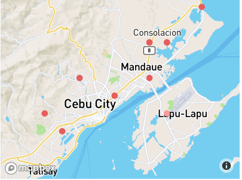
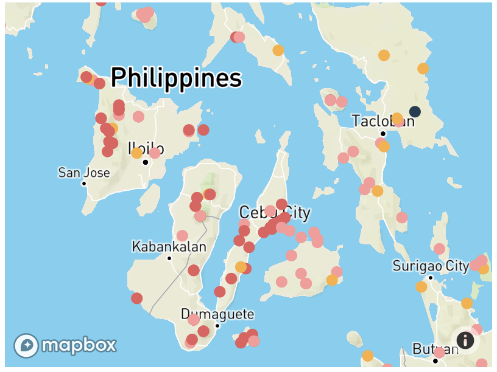
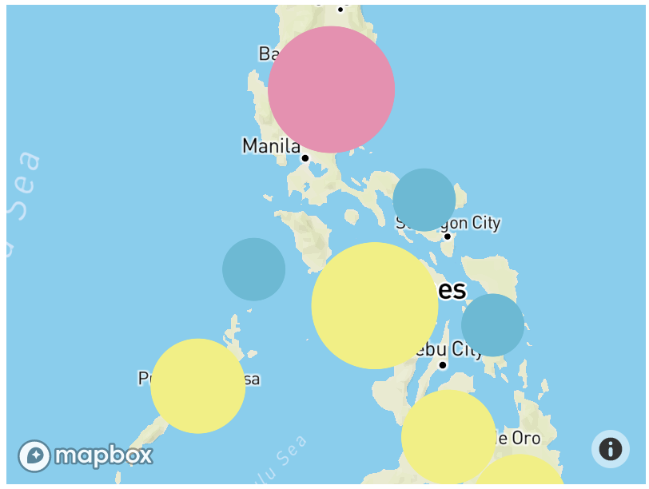
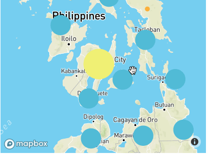

# Adding interactivity to your map (information pop-up and data clustering).

This tutorial will guide you to adding information popups to your map and 
improve the visual style of the data using clustering. 

## Displaying popup to show data information on click. 

* Open your `index.html` in your text editor. 
* Add the following code within your script, after the `circle-color` expressions

```javascript

map.on('click', 'birds', function (e) {
var coordinates = e.features[0].geometry.coordinates.slice();
var description = e.features[0].properties.en_name;

while (Math.abs(e.lngLat.lng - coordinates[0]) > 180) {
coordinates[0] += e.lngLat.lng > coordinates[0] ? 360 : -360;
}

new mapboxgl.Popup()
.setLngLat(coordinates)
.setHTML(description)
.addTo(map);
});

```
The above code does the following: when a click event occurs on a feature in the birds layer, open a popup at the
location of the feature, with description HTML from its properties.

* Save your `index.html` and open the file in your browser.



## Clustering overlapping points

Our current point styling looks cluttered at low zoom level, for example, there are a lot of overlapping points
with a lot of bird sightings.  We can improve the visuals of our map by adding clustering using the same data-driven 
styling capabilities of Mapbox GL JS.



* Open your `index.html` and change the `map.addSource` section of the code.

```javascript
map.addSource('birds', { type: 'geojson',
                             data: url,
                             cluster: true,
                             clusterMaxZoom: 12,
                             clusterRadius: 30 });
```

This change activates the clustering option to your GeoJSON with a max zoom to cluster points on z12 and 
the radius of each cluster when clustering points.

* Add the following code, after preceding the  `map.addSource`.

```javascript
    map.addLayer({
      id: "clusters",
      type: "circle",
      source: "birds",
      filter: ["has", "point_count"],
      paint: {
        "circle-color": [
          "step",
          ["get", "point_count"],
          "#51bbd6",50,
          "#f1f075",100,
          "#f28cb1"
        ],
        "circle-radius": [
          "step",
          ["get", "point_count"],
          20,50,
          30,100,
          40
        ]
      }
    });

```

This code uses the [step expressions](https://docs.mapbox.com/mapbox-gl-js/style-spec/#expressions-step)
to style clustered points with three types of circles:

* Blue, 20px circles when point count is less than 50
* Yellow, 30px circles when point count is between 50 and 100
* Pink, 40px circles when point count is greater than or equal to 150

* Save your `index.html` and open the file in your browser.



* Finally, change your earlier point style to show colors for unclustered points by its status and show pop-up.

```javascript
    map.addLayer({
      "id": "unclustered-point",
      "type": "circle",
      "source": "birds",
      "filter": ["!", ["has", "point_count"]],
      'paint': {
        'circle-radius': {
          'base': 1.75,
          'stops': [[10, 5], [16, 50]]
        },
        'circle-color': [
          'match',
          ['get', 'status'],
          'CR', '#fbb03b',
          'DD', '#223b53',
          'EN', '#e55e5e',
          'Nt', '#3bb2d0',
          'VUL','#fb9a99',
          /* other */ '#000'
        ],
        "circle-stroke-width": 1,
        "circle-stroke-color": "#fff"
      }
    });

map.on('click', 'unclustered-point', function (e) {
var coordinates = e.features[0].geometry.coordinates.slice();
var description = e.features[0].properties.en_name;

while (Math.abs(e.lngLat.lng - coordinates[0]) > 180) {
coordinates[0] += e.lngLat.lng > coordinates[0] ? 360 : -360;
}

new mapboxgl.Popup()
.setLngLat(coordinates)
.setHTML(description)
.addTo(map);
});
```

* Save your `index.html` and open the file in your browser.



Congratulations!  You have finished our map! Inspect your code and experiment with different `circle-color` and `circle-size`
you think are visually pleasing to your clusters.

## See also

* [Display a popup on click](https://docs.mapbox.com/mapbox-gl-js/example/popup-on-click/)
* [Show polygon information on click](https://docs.mapbox.com/mapbox-gl-js/example/polygon-popup-on-click/)
* [Create and style clusters](https://docs.mapbox.com/mapbox-gl-js/example/cluster/)
